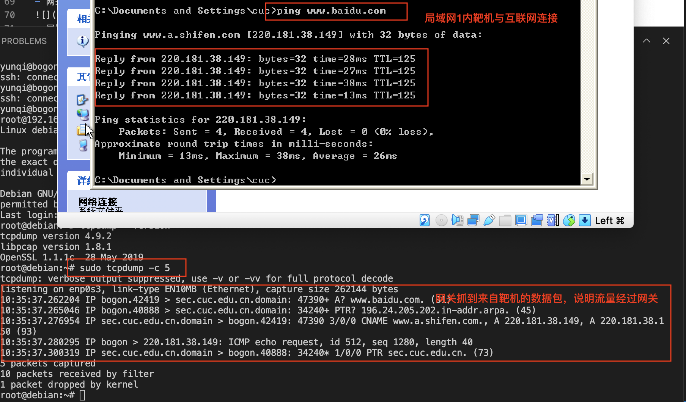
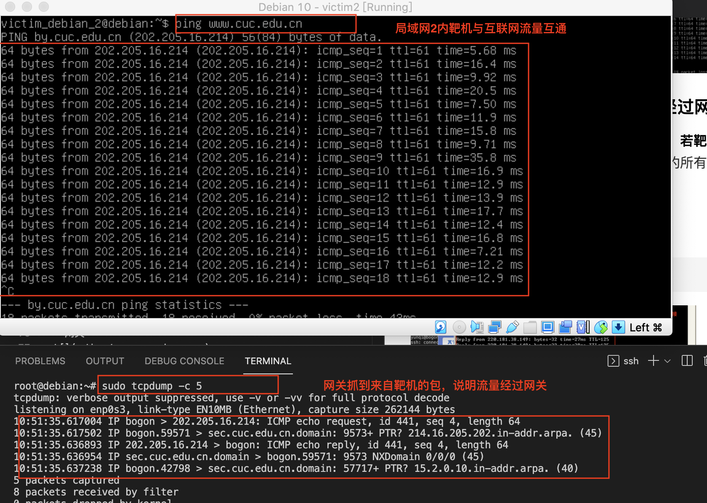

# 基于 VirtualBox 的网络攻防基础环境搭建
## 实验目的
- 掌握 VirtualBox 虚拟机的安装与使用；
- 掌握 VirtualBox 的虚拟网络类型和按需配置；
- 掌握 VirtualBox 的虚拟硬盘多重加载；
## 实验环境
以下是本次实验需要使用的网络节点说明和主要软件举例：

- VirtualBox 虚拟机
- 攻击者主机（Attacker）：Kali Rolling (2021.1) x64
- 网关（Gateway, GW）：Debian Buster
- 靶机（Victim）：From Sqli to shell / xp-sp3 / Kali

## 实验要求
- 虚拟硬盘配置成多重加载，效果如下图所示；


- 搭建满足如下拓扑图所示的虚拟机网络拓扑；


根据实验宿主机的性能条件，可以适度精简靶机数量

- 完成以下网络连通性测试；
- [x] 靶机可以直接访问攻击者主机
- [x] 攻击者主机无法直接访问靶机
- [x] 网关可以直接访问攻击者主机和靶机
- [x] 靶机的所有对外上下行流量必须经过网关
- [x] 所有节点均可以访问互联网

## 实验步骤
### 一、配置虚拟硬盘多重加载
- VirtualBox虚拟机管理 -> 虚拟介质管理
- 选中所需的虚拟盘，将属性 -> 类型 修改为多重加载
- 释放盘片后重新加载虚拟硬盘

### 二、搭建虚拟机网络拓扑
#### 1. 配置拓扑所需网络
- **网关**需四块网卡
    - NAT网络，使网关可访问攻击者主机；
    - 仅主机（Host-Only）网络，进行网卡设置；
    - 内部网络intnet1，搭建局域网1；
    - 内部网络intnet2，搭建局域网2。

- **攻击者**需三块网卡
    - NAT网络;
    - 两块不同的Host-Only.

- **victim**都需一块网卡
    - 内部网络，使不同组的victim在不同局域网内;
    - victim-xp-1 与 victim-kali-1 在同一局域网内（intnet1）；
    victim-xp2 与 victim-debian-2 在同一局域网内（intnet2）


### 三、连通性测试
| 节点 | ip地址 | MAC地址 |
| :----:| :----: | :----: |
| Kali-Attacker | 10.0.2.15 | 08:00:27:1d:4d:37 |
| Kali-Victim1 | 172.16.111.128 |  08:00:27:6b:aa:55 |
| Windows XP-Victim1 | 172.16.111.138 | 08-00-27-25-41-3E |
| Debian10-Victim2 | 172.16.222.102 | 08:00:27:02:8e:3c |
| Windows XP-Victim2 | 172.16.222.147 | 08-00-27-2D-37-51 |
#### 1.靶机可以直接访问攻击者主机
- 局域网1内靶机可直接访问攻击者主机

- 局域网2内靶机可直接访问攻击者主机

#### 2.攻击者主机无法直接访问靶机
- 攻击者无法直接访问局域网1内的靶机

- 攻击者无法直接访问语句网2内的靶机

#### 3.网关可以直接访问攻击者主机和靶机
- 网关访问攻击者主机

- 网关访问局域网1内靶机

- 网关访问局域网2内靶机

#### 4.靶机的所有对外上下行流量必须经过网关
- 靶机与互联网互通的过程中**用网关抓包，若靶机发送的所有包都能被网关抓到**，说明靶机的所有对外上下行流量必须经过网关。
    - 清空靶机ARP缓存及DNS缓存
    - 靶机与互联网互通：
    - 网关抓包
1.直接使用tcpdump：```sudo tcpdump -c 5```
局域网1内的靶机

局域网2内的靶机


2.利用tmux将抓包数据文件复制到主机用WireShark分析

使用靶机访问**www.cuc.edu.cn** **www.baidu.com**，在文件中都能找到相应的包，说明靶机的所有对外上下行流量必须经过网关


#### 5.所有节点均可以访问互联网
- 网关

- 攻击者

- 局域网1内的靶机

- 局域网2内的靶机


## 问题与解决方法
- 问题1：在把网关的第一块网卡改为NAT网络时显示无效修改
- 解决方法：VirtualBox控制 -> 设置 -> 网络,点击右侧加号标志就会出现NatNetwork选项，点击右下角OK完成设置。
 