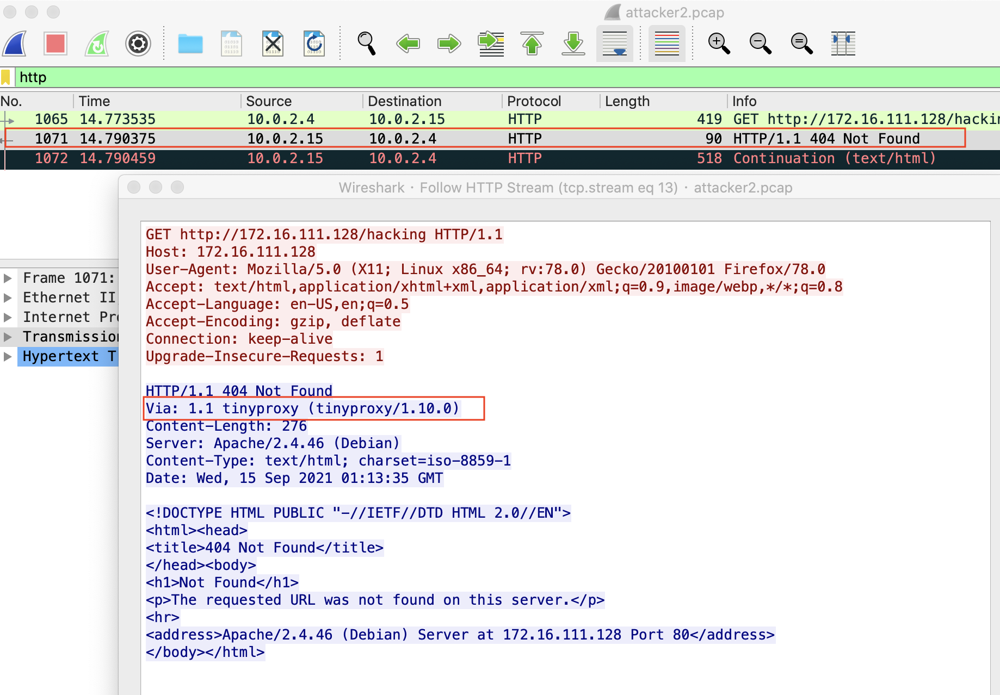
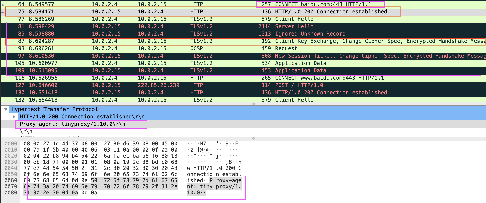

# HTTP代理服务器实验
## 实验目的
- Kali-gateway中安装```tinyproxy```
- 用主机设置浏览器代理指向tinyproxy建立的HTTP正向代理
- 在Kali中用wireshark抓包
- 分析抓包过程，理解HTTP正向代理HTTPS流量的特点

## 实验步骤
#### 1.准备好实验所需的拓扑结构并验证连通性

|      |攻击者|网关|靶机|
| :---:| :---:| :---: | :----: |
|攻击者	|-|	√	|x|
|网关	|√|	-	|√|
|靶机|	√	|√|	-|
- 攻击者可以ping通网关，不能ping通靶机，可以上网
  
- 网关可以ping通攻击者，可以ping通靶机，可以上网
  
- 靶机可以ping通攻击者，可以ping通网关，可以上网
  
#### 2.在网关配置tinyproxy
```
apt-get update & apt-get install tinyproxy
# 备份tinyproxy配置文件
cp /etc/tinyproxy/tinyproxy.conf /etc/tinyproxy/tinyproxy.conf.bak
# 编辑tinyproxy配置文件
vim /etc/tinyproxy/tinyproxy.conf
# 开启tinyproxy服务
systemctl start tinyproxy
```
```
vim /etc/tinyproxy/tinyproxy.conf
```
- 允许NAT网络内的节点使用网关的代理服务


#### 3.在攻击者主机的浏览器中配置代理服务
- 打开firefox，依次点击```Preferences-Advanced-Network-Connection Settings```进入代理设置，填写网关IP及端口号


#### 4.使用tinyproxy访问靶机
在攻击者的firefox上配置并启用代理服务器后，同时在攻击者、网关、靶机开启抓包：

**1. 攻击者主机**
- 使用firefox访问靶机127.16.111.128和127.16.111.128/hacking，分别显示Apache默认页面和404页面，没有直接给出代理服务器信息。


- 使用wireshark进行抓包分析，发现HTTP响应里含有```Via: 1.1 tinyproxy (tinyproxy/1.10.0)```字段


**2. 网关**
- 使用wireshark进行抓包分析，发现HTTP响应里含有Via: 1.1 tinyproxy (tinyproxy/1.10.0)字段

    - 网关保留HTTP GET请求内容，若攻击者主机（客户端）的浏览器不清除历史记录，则下次访问同样的HTTP服务时用时非常短

    - 若在网关设置防火墙规则过滤攻击者主机（客户端）发出的的请求，则攻击者主机依然无法访问靶机端的HTTP服务

    - 代理层可以理解HTTP报文

**3. 靶机**
- 使用wireshark进行抓包分析，发现HTTP响应里含有Via: 1.1 tinyproxy (tinyproxy/1.10.0)字段

    - HTTP协议中出现Via字段，说明网关（代理服务器）正在提供代理服务

    - 攻击者主机IP地址、以太网接口均未暴露

**使用tinyproxy访问https页面**
- 在攻击者主机上用firefox访问https://www.baidu.com，并在网关上进行抓包

- 使用https，代理服务器（即网关处）能看到用户访问的网址，但是传输的数据被加密了。
  - wireshark分析抓到的数据包可知，在TLS协议前还有一个和代理服务器建立连接的的过程，经过密钥交换和密钥协商后，用户和目标网站的通信都进行了加密。



## 实验小结

- 通过代理服务器可以绕过某些访问限制；
- 代理服务器可以看到用户访问的网址；
- 代理服务器无法看到https通信数据，但仍有可能受中间人攻击的威胁。

## 课后习题
#### 1.代理技术在网络攻防中的意义？

##### (1) 对攻方的意义？
能访问本无法访问的机器（如本实验中攻击者访问靶机）。
被攻击者无法判断攻方身份（如本实验中靶机无法确定攻击者的身份），攻击无法溯源。

##### (2) 对守方的意义？
攻方也无法辨认守方身份，无法确定攻击对象。

#### 2.常规代理技术和高级代理技术的设计思想区别与联系？
- 区别：
高级代理技术更具匿名性，使⽹络安全对抗过程变得复杂。
- 联系：
有时可以通过常用代理技术实现高级代理，实现起来相对简单高效。
​


## 参考文档
- [Transport_Layer_Security](https://en.wikipedia.org/wiki/Transport_Layer_Security)
- [CUCCS/2018-NS-Public-jckling](https://github.com/CUCCS/2018-NS-Public-jckling/blob/master/ns-0x03/3.md)