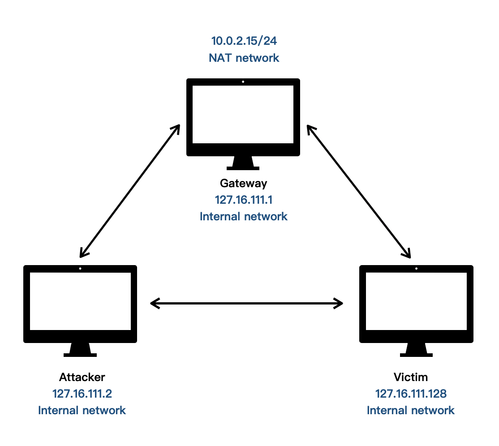

# 实验四 网络监听
## 一、检测局域网中的异常终端
### 实验环境
#### 拓扑结构

#### 网络配置及arp表
##### 1.攻击者

##### 2.网关


#### ICMP-ping
**1.攻击者**
攻击者向网关发送ping包，并进行抓包
```
#发5个包
ping 10.0.2.15 -c 5

#抓包
tcpdump -s 65535 -i eth0 -w orgin_0.pcap

#查看抓包结果
tshark -r orgin_0.pcap -n
```


**2.网关**
网关同时进行抓包
```
#抓包
tcpdump -s 65535 -i enp0s3 -w orgin_0.pcap

#查看抓包结果
tshark -r orgin_0.pcap -n
```


#### ARP请求
- 在攻击者主机上使用```promiscping```进行探测并抓包

- 查看抓包结果
>只有arp请求,没有响应


- 攻击者构造ICMP数据包：
  - 源MAC地址是必须的；
  - 源MAC地址不会自动填充为本机网卡的MAC地址，需手动填充；
  - 源IP地址会自动填充。
  


- 攻击者发送构造的数据包进行探测,并抓包


- 抓包结果，只有发出的数据包，无响应包


#### 混杂模式
- 网关网卡开启混杂模式
```
# 打开混杂模式
ip link set enp0s3 promisc on
# 查看网卡信息
ifconfig enp0s3
```


- 攻击者使用```promiscping```探测，并抓包


- 抓包结果


- 攻击者构造并发送数据包进行探测，同时抓包


- 抓包结果


- 使用wireshark对抓到的两个包进行查看和比较
    - 创建数据包的时候使用的是ICMP()，故抓到的包属于ICMP包
    - promiscping采用ARP协议自动构建数据包并发送。


## 问题及解决方法
- 一开始在攻击者主机上使用```promiscping```进行探测并抓包时报 ```PermissionError: [Errno 1] Operation not permitted``` 错

- 解决方法：使用管理员权限运行scapy即可


## 二、ARP欺骗
### 实验环境
- gw:172.16.111.1
- kali-victim:172.16.111.128
- kali-attacker:172.16.111.2

#### 拓扑结构

#### 初始arp表
- 攻击者主机


- 网关


- 靶机


#### 连通性测试及更新的arp表
- 攻击者主机


- 网关


- 靶机


### 实现arp欺骗
- 在攻击者主机上使用```arpspoof```工具对靶机污染
```
arpspoof -i eth3 -t 172.16.111.128 172.16.111.1
```
- 污染并抓包

  - 此时在靶机上已经无法正常上网

- 靶机arp表被污染


- 查看污染过程中抓到的包


### 问题与解决方法
- 问题1:在给kali-attacker开启内部网络intnet1网卡后查看其ip地址表，内部网络对应的网卡仍然没有分配ip地址
- 解决方法:
```
sudo vim /etc/network/interfaces
```
将文件内容修改如下


- 问题2:arpspoof命令语句使用无误，但无法正常污染靶机的arp表
- 解决方法：打开虚拟机IP转发功能
```
echo 1 > /proc/sys/net/ipv4/ip_forward
```
