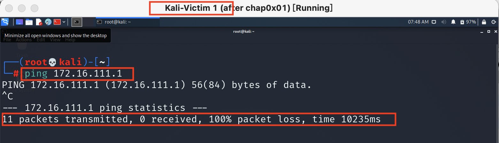
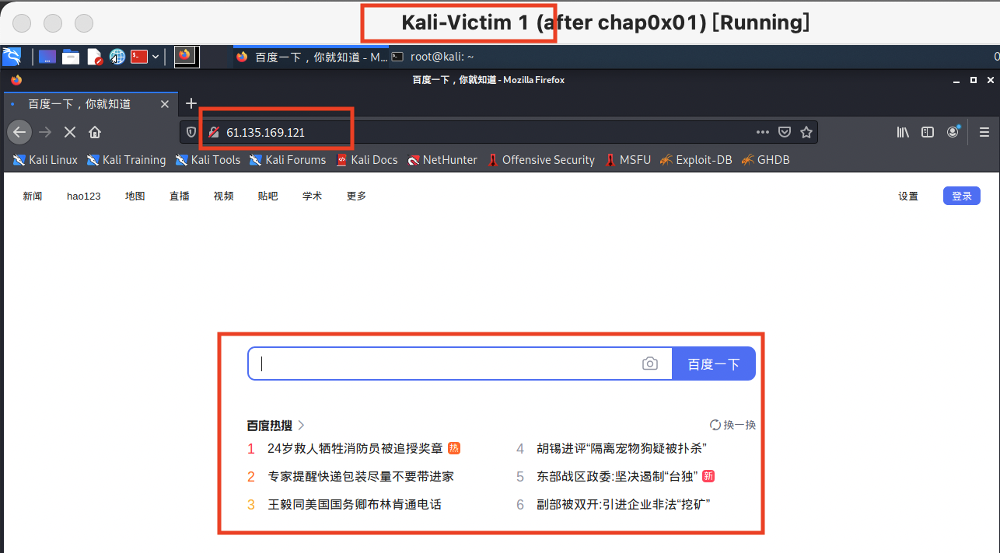
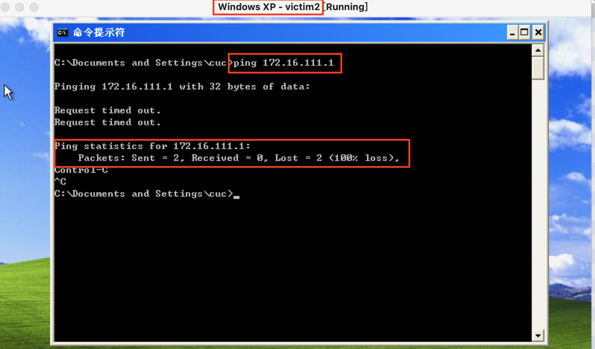
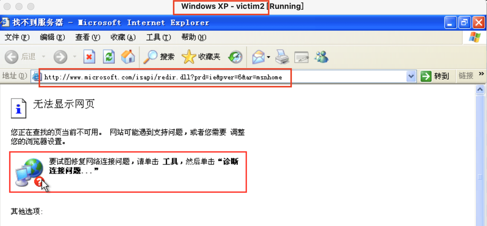

# 第八章 防火墙实验
## 课外实验
### 一、场景描述
- 假定如下局域网拓：
  
  ```
  +----------------------+          +-------------------------+       +----------------------+     
  |     host-1           |          |   host-2                |       |     host-3           |  
  |     172.16.18.11     |          |   eth0:0 172.16.18.1    |       |     172.16.18.12     |  
  |                      |          |   eth0: 192.168.1.123   |       |                      |  
  +-------------+--------+          +----------+--------------+       +-------------+--------+  
                |                              |                                    |
                |                              |                                    |
       +--------+------------------------------+--+                                 |
       |                交换机                    |---------------------------------+
       +-----------------+------------------------+
                         |
                         |
                   +-----+-----------+
                   |   eth0          |   `
                   |   192.168.1.1   |
                +--+-----------------+---------+
                |                              |
                |        host-gw / dns-svr     |
                |                              |
                +------------------+----------++
                                   |  eth1    |
                                   +----------+
  ```
  - host-gw 指的是该局域网的网关，已经配置为 NAT 方式，局域网内的主机 host-2 可以正常无障碍访问互联网；
  - dns-svr 指的是该局域网中的 DNS 解析服务器，可以正常提供域名解析服务；
  - 交换机没有设置 VLAN，所有端口正常工作；
  - host-2上配置了 iptables规则；
  - host-1上配置了默认网关指向 IP 地址：172.16.18.1，域名解析服务器配置 为 IP：192.168.1.1
  - host-3上配置了默认网关指向 IP 地址：172.16.18.1，域名解析服务器配置为 IP：192.168.1.1
### 二、 先验知识
#### 1.iptables的结构
`iptables -> Tables -> Chains -> Rules`,tables由chains组成，chains由rules组成:

#### 2.iptables的表与链
- **Filter表（默认表）**
  - **INPUT链** – 处理来自外部的数据。当经过路由判断后，要进入本机的数据包执行的规则。
  - **OUTPUT链** – 处理向外发送的数据。由本机产生，需向外发的数据包执行的规则。
  - **FORWARD链** – 将数据转发到本机的其他网卡设备上。目的地不是本机，并需要将其路由到最终地址或下一跳的数据包执行的规则。
- **NAT表**
  - **PREROUTING链** – 处理刚到达本机并在路由转发前的数据包。它会转换数据包中的目标IP地址，通常用于DNAT(destination NAT)
系统是先进入 DNAT，然后才进入路由及过虑等操作
保存翻译的映射关系到内存
  - **POSTROUTING链** – 处理即将离开本机的数据包。它会转换数据包中的源IP地址，通常用于SNAT(source NAT)
需要注意的是，系统在路由及过虑等处理直到数据包要被送出时才进入 SNAT
保存翻译的映射关系到内存
  - **OUTPUT链** – 处理本机产生的数据包
- **Mangle表**：Mangle表用于指定如何处理数据包。它能改变TCP头中的QoS位,Mangle表具有5个内建链：
  - **PREROUTING链**
  - **OUTPUT链**
  - **FORWARD链**
  - **INPUT链**
  - **POSTROUTING链**
- **Raw表**：Raw表用于处理异常，它具有2个内建链：
  - **PREROUTING链**
  - **OUTPUT链**

#### 3.iptables的规则
- iptables命令格式
```bash
iptables [-t 表] 命令 匹配 操作
```
- 命令选项表
  
    | 命令                      | 说明                               |
    | :------------------------ | :--------------------------------- |
    | -P或--policy <链名>       | 定义默认策略                       |
    | -L或--list <链名>         | 查看iptables规则列表               |
    | -A或--append <链名>       | 在规则列表的最后增加1条规则        |
    | -I或--insert <链名>       | 在指定的位置插入1条规则            |
    | -D或--delete <链名>       | 从规则列表中删除1条规则            |
    | -R或--replace <链名>      | 替换规则列表中的某条规则           |
    | -F或--flush <链名>        | 删除规则列表中所有规则             |
    | -Z或--zero <链名>         | 将表中数据包计数器和流量计数器归零 |
    | -X或--delete-chain <链名> | 删除空的规则列表                   |
    | -N或--new-chain <链名>    | 新建规则列表                       |

- 匹配选项表
  
    | 匹配                | 说明                                                         |
    | :------------------ | :----------------------------------------------------------- |
    | -i<网络接口名>      | 指定数据包从哪个网络接口进入，如ppp0、eth0和eth1等           |
    | -o<网络接口名>      | 指定数据包从哪块网络接口输出，如ppp0、eth0和eth1等           |
    | -p<协议类型>        | 指定数据包匹配的协议，如TCP、UDP和ICMP等，默认为all          |
    | -s<源地址或子网>    | 指定数据包匹配的源地址                                       |
    | --sport <源端口号>  | 指定数据包匹配的源端口号，可以使用“起始端口号:结束端口号”的格式指定一个范围的端口 |
    | -d<目标地址或子网>  | 指定数据包匹配的目标地址                                     |
    | --dport<目标端口号> | 指定数据包匹配的目标端口号，可以使用“起始端口号:结束端口号”的格式指定一个范围的端口 |
    | -j                  | 决定当与规则匹配时如何处理数据包                             |
    | -m state            | 启用状态匹配模块                                             |
    | -–tcp-flags         | (**针对-p tcp**)可以指定由逗号分隔的多个参数，有效值可以是：SYN, ACK, FIN, RST, URG, PSH |
    | –-state             | 状态匹配模块的参数。NEW、ESTABLISHED、RELATED                |

- 动作选项表
  
    | 动作       | 说明                                                         |
    | :--------- | :----------------------------------------------------------- |
    | **基本**   |                                                              |
    | ACCEPT     | 接受数据包                                                   |
    | DROP       | 丢弃数据包                                                   |
    | QUEUE      | 将数据包移交到用户空间                                       |
    | RETURN     | 停止执行当前链中的后续Rules，并返回到调用链(the calling chain)中 |
    | **拓展**   |                                                              |
    | REDIRECT   | 将数据包重新转向到本机或另一台主机的某个端口，通常用功能实现透明代理或对外开放内网某些服务 |
    | SNAT       | 源地址转换，即改变数据包的源地址                             |
    | DNAT       | 目标地址转换，即改变数据包的目的地址                         |
    | MASQUERADE | IP伪装，即是常说的NAT技术，MASQUERADE只能用于ADSL等拨号上网的IP伪装，也就是主机的IP是由ISP分配动态的；如果主机的IP地址是静态固定的，就要使用SNAT |
    | LOG        | 日志功能，将符合规则的数据包的相关信息记录在日志中，以便管理员的分析和排错 |
  - **RETURN**
  
    > 顾名思义，它使包返回上一层，顺序是：子链——>父链——>缺省的策略。具体地说，就是若包在子链 中遇到了RETURN，则返回父链的下一条规则继续进行条件的比较，若是在父链（或称主链，比如INPUT）中 遇到了RETURN，就要被缺省的策略（一般是ACCEPT或DROP）操作了
  
  - **SNAT**
  
    > 比如，多个PC机使用ADSL路由器共享上网，每个PC机都配置了内网IP。PC机访问外部网络的时候，路由器将数据包的报头中的源地址替换成路由器的ip，当外部网络的服务器比如网站web服务器接到访问请求的时候，他的日志记录下来的是路由器的ip地址，而不是pc机的内网ip。这是因为，这个服务器收到的数据包的报头里边的“源地址”，已经被替换了。
  
  - **DNAT**
  
    > 典型的应用是，有个web服务器放在内网配置内网ip，前端有个防火墙配置公网ip。互联网上的访问者使用公网ip来访问这个网站。当访问的时候，客户端发出一个数据包，这个数据包的报头里边，目标地址写的是防火墙的公网ip。防火墙会把这个数据包的报头改写一次，将目标地址改写成web服务器的内网ip，然后再把这个数据包发送到内网的web服务器上。这样，数据包就穿透了防火墙，并从公网ip变成了一个对内网地址的访问了
  
  - **MASQUERADE**
    > 地址伪装，在iptables中有着和SNAT相近的效果，但也有一些区别:
    >
    > * 用SNAT的时候，出口ip的地址范围可以是一个，也可以是多个
    >
    >   ```sh
    >   iptables -t nat -A POSTROUTING -s 10.8.0.0/255.255.255.0 -o eth0 -j SNAT --to-source 192.168.5.3-192.168.5.5
    >   ```
    >
    > * 如上👆命令表示把所有10.8.0.0网段的数据包SNAT成192.168.5.3/192.168.5.4/192.168.5.5等几个ip然后发出去。但是，对于SNAT，不管是几个地址，必须明确的指定要SNAT的ip（而这可能会动态变化）
    >
    > * MASQUERADE就是针对这种场景而设计的，他的作用是，从服务器的网卡上，自动获取当前ip地址来做NAT
  
- **查看特定表的规则**：`iptables -t <table> --list`

- **默认策略定义**：`iptables [-t 表名] <-P 默认策略> <链名> <动作>`

  * 当数据包不属于链中任何规则时，iptables将根据该链预先定义的默认策略处理数据包

- 0.0.0.0/0

  > 在路由器配置中可用0.0.0.0/0表示默认路由，作用是帮助路由器发送路由表中无法查询的包。如果设置了全零网络的路由，路由表中无法查询的包都将送到全零网络的路由中去。严格说来，0.0.0.0已经不是一个真正意义上的IP地址了。它表示的是这样一个集合：所有未知的主机和目的网络。
  > 这里的“未知”是指在本机的路由表里没有特定条目指明如何到达


### 三、实验过程
#### 搭建网络拓扑

##### 各主机网卡配置：
- host1

- host2

- host3

- gateway


#### 实验内容
- 对 host-2 上的 iptables 配置脚本逐行添加代码注释并运行
```sh
#!/bin/bash

IPT="/sbin/iptables"

$IPT --flush # 清空所有链中所有规则
$IPT --delete-chain # 删除所有空链

$IPT -P INPUT DROP # INPUT链默认DROP规则，即默认丢包
$IPT -P FORWARD DROP # FORWARD规则DROP规则，即默认丢包
$IPT -P OUTPUT ACCEPT # OUTPUT链默认ACCEPT规则，即默认输出

$IPT -N forward_demo # 新建forward_demo链
$IPT -N icmp_demo # 新建icmp_demo链

$IPT -A INPUT -i lo -j ACCEPT # 允许回环输入
$IPT -A OUTPUT -o lo -j ACCEPT # 允许回环输出

# 丢弃所有建立TCP请求且不包含SYN的包
$IPT -A INPUT -p tcp ! --syn -m state --state NEW -s 0.0.0.0/0 -j DROP 
# 接收所有入站TCP数据包
$IPT -A INPUT -m state --state ESTABLISHED,RELATED -j ACCEPT 
# 接收icmp包，跳转到icmp_demo链上规则处理
$IPT -A INPUT -p icmp -j icmp_demo 

# 接收进入eth3的icmp包
$IPT -A icmp_demo -p icmp -i eth3 -j ACCEPT 
# 丢包，从子链（当前icmp_demo链）返回父链（调用链）
$IPT -A icmp_demo -j RETURN 

# forward_demo处理路由转发
$IPT -A FORWARD -j forward_demo 

# 把forward_demo链的日志记录到前缀为FORWARD_DEMO的日志
$IPT -A forward_demo -j LOG --log-prefix FORWARD_DEMO 
# 禁止转发URL中含‘baidu’的tcp包
$IPT -A forward_demo -p tcp --dport 80 -m string --algo bm --string 'baidu' -j DROP 
# 转发来自host-1的tcp包
$IPT -A forward_demo -p tcp -s 172.16.18.11 -j ACCEPT 
# 转发前往host-1的tcp包
$IPT -A forward_demo -p tcp -d 172.16.18.11 -j ACCEPT
# 转发来自host-1的udp包
$IPT -A forward_demo -p udp -s 172.16.18.11 --dport 53 -j ACCEPT
# 转发来自host-2的udp包
$IPT -A forward_demo -p udp -s 172.16.18.1  --dport 53 -j ACCEPT
# 转发来自host-gw的udp包
$IPT -A forward_demo -p udp -s 172.16.111.1  --sport 53 -j ACCEPT
# 转发自host-gw的的tcp包 
$IPT -A forward_demo -p tcp -s 172.16.111.1 -j ACCEPT
# 丢包，对来自host-2的数据包转父链处理
$IPT -A forward_demo -s 172.16.18.1 -j RETURN
# 来自172.16.18.1/24网段的数据包，动态读取其eth3的ip做SNAT并输出
$IPT -t nat -A POSTROUTING -s 172.16.18.1/24 -o eth3 -j MASQUERADE
```

- 运行以上脚本后，host2的防火墙如下：
```shell
Chain INPUT (policy DROP)
target     prot opt source               destination         
ACCEPT     all  --  0.0.0.0/0            0.0.0.0/0           
DROP       tcp  --  0.0.0.0/0            0.0.0.0/0            tcp flags:!0x17/0x02 state NEW
ACCEPT     all  --  0.0.0.0/0            0.0.0.0/0            state RELATED,ESTABLISHED
icmp_demo  icmp --  0.0.0.0/0            0.0.0.0/0           

Chain FORWARD (policy DROP)
target     prot opt source               destination         
forward_demo  all  --  0.0.0.0/0            0.0.0.0/0           

Chain OUTPUT (policy ACCEPT)
target     prot opt source               destination         
ACCEPT     all  --  0.0.0.0/0            0.0.0.0/0           

Chain forward_demo (1 references)
target     prot opt source               destination         
LOG        all  --  0.0.0.0/0            0.0.0.0/0            LOG flags 0 level 4 prefix "FORWARD_DEMO"
DROP       tcp  --  0.0.0.0/0            0.0.0.0/0            tcp dpt:80 STRING match  "baidu" ALGO name bm TO 65535
ACCEPT     tcp  --  172.16.18.11         0.0.0.0/0           
ACCEPT     tcp  --  0.0.0.0/0            172.16.18.11        
ACCEPT     udp  --  172.16.18.11         0.0.0.0/0            udp dpt:53
ACCEPT     udp  --  172.16.18.1          0.0.0.0/0            udp dpt:53
ACCEPT     udp  --  172.16.111.1       0.0.0.0/0            udp spt:53
ACCEPT     tcp  --  172.16.18.1       0.0.0.0/0           
RETURN     all  --  172.16.18.1          0.0.0.0/0           

Chain icmp_demo (1 references)
target     prot opt source               destination         
ACCEPT     icmp --  0.0.0.0/0            0.0.0.0/0           
RETURN     all  --  0.0.0.0/0            0.0.0.0/0   
  
Chain PREROUTING (policy ACCEPT)
target     prot opt source               destination         

Chain INPUT (policy ACCEPT)
target     prot opt source               destination         

Chain OUTPUT (policy ACCEPT)
target     prot opt source               destination         

Chain POSTROUTING (policy ACCEPT)
target     prot opt source               destination         
MASQUERADE  all  --  172.16.18.0/24       0.0.0.0/0        
```


### 四、实验结果

**1. host-1可以ping通ip: 172.16.18.1吗?**
> 可以


- `$IPT -A icmp_demo -p icmp -i eth3 -j ACCEPT`，接收eth3进入的icmp包；
- host-2配置了虚拟网卡`eth3:0`，接收host-1的`echo request`；
- `$IPT -P OUTPUT ACCEPT`，host-2将返回`echo reply`，所以可以ping通。

**2. host-1可以ping通ip: 192.168.1.1(对应本实验中172.16.111.1)吗？**
>不可以


- `host-1`的默认网关是`host-2`，需经`host-2`转发到`dns-svr`;
- `host-1`发送icmp数据包经FORWARD链转至forward_demo链；
- 而forword_demo链上没有对应的转发规则，故丢弃，所以不可以ping通。

**3. host-1可以ping通域名:www.baidu.com吗？**
> 不可以


- `host-1`的默认网关是`host-2`，需经`host-2`转发到`dns-svr`，
- `$IPT -A forward_demo -p tcp --dport 80 -m string --algo bm --string 'baidu' -j DROP`，`host-2`禁止转发URL里有‘baidu’的包；
- 所以不可以访问。

**4. host-1可以访问:www.baidu.com吗？**
> 不可以


- `host-1`的默认网关是`host-2`，需经`host-2`转发到`dns-svr`，
- `$IPT -A forward_demo -p tcp --dport 80 -m string --algo bm --string 'baidu' -j DROP`，`host-2`禁止转发URL里有‘baidu’的包
- 所以不可以访问。


**5. host-1可以访问:http://61.135.169.121 吗？**
> 可以


- `host-1`发送数据包给`host-2`，`host-2`经动态ip转换后发给`host-gw`；
- `host-gw`做NAT发送最终的`http get`；
- `host-gw`发送http response到`host-2`，`host-2`做DNAT返回给`host-1`，所以可以访问.

**6. host-3可以ping通ip: 172.16.18.1吗？**
>可以


- `$IPT -A icmp_demo -p icmp -i eth3 -j ACCEPT`，接收eth3进入的icmp包；
- `host-2`配置了虚拟网卡`eth3:0`，接收`host-3`的`echo request`；
- `$IPT -P OUTPUT ACCEPT`，host-2将返回`echo reply`，所以可以ping通。

**7. host-3可以ping通ip: 192.168.1.1（对应本实验中172.16.111.1）吗？**
>不可以


- `host-3`的默认网关是`host-2`，需经`host-2`转发到`dns-svr`;
- `host-3`发送icmp数据包经FORWARD链转至forward_demo链；
- 而forword_demo链上没有对应的转发规则，故丢弃，所以不可以ping通。

**8. host-3可以访问互联网吗？**
>不可以


- `host-3`发送udp数据包(DNS)经FORWARD链至forward_demo链；
- udp包中，源ip地址172.16.18.12，目标端口53，在forward_demo链中无对应规则，故丢弃，所以不可以访问.

### 五、参考资料
- [iptables详细教程：基础、架构、清空规则、追加规则、应用实例](https://lesca.me/archives/iptables-tutorial-structures-configuratios-examples.html)
- [网络安全在线课本](https://c4pr1c3.github.io/cuc-ns/chap0x08/exp.html)
- [CUCCS/2018-NS-Public-jckling](https://github.com/CUCCS/2018-NS-Public-jckling/tree/master/ns-0x08)

